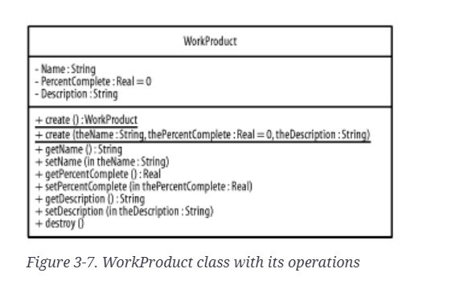

# Class Diagram Explanation
The WorkProduct class represents a unit of work within the system. It contains three private attributes: name, percentComplete, and description, which store the work product’s identifier, progress status, and detailed information respectively. To maintain encapsulation, the class provides public getter and setter methods that allow controlled access to and modification of these attributes.

The class includes an overloaded create method. One version creates and returns a WorkProduct object using default values, while the other accepts parameters to initialise the object, with percentComplete having a default value of zero. In addition, the destroy method is provided to handle the proper removal or cleanup of a WorkProduct instance when it is no longer needed.