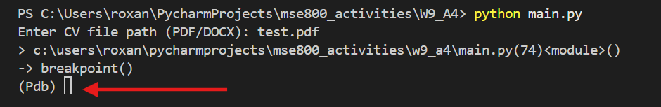
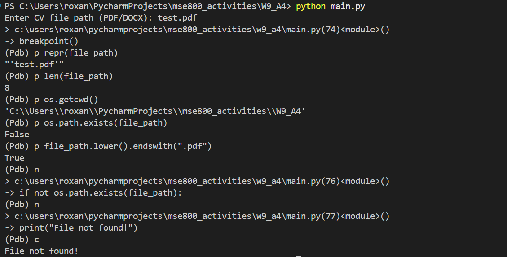

`pdb` is Python’s built-in debugger. It allows you to pause a program while it is running and inspect what is happening inside the code. No installation is required because it is included in Python’s standard library.

To test the CV analyzer script, we only need to add one line:

```bash
breakpoint()
```

This automatically starts the pdb debugger when the program reaches that line.

For example, to debug issues related to file_path, the breakpoint can be placed immediately after the file input statement. This allows verification of whether the path entered by the user is correct.


When the program pauses, (Pdb) appears in the terminal. This indicates that the debugger is active and waiting for commands.



At this point, you can inspect variables to detect problems such as extra spaces in the file path, incorrect file extensions, wrong directories, files that do not exist.

---

## How to Run

Run the script normally from the terminal:

```bash
python main.py
```

When (Pdb) appears, enter one of the following commands:
* p variable - print the value of a variable
* n - execute the next line
* c - continue running the program
* q - quit the debugger

