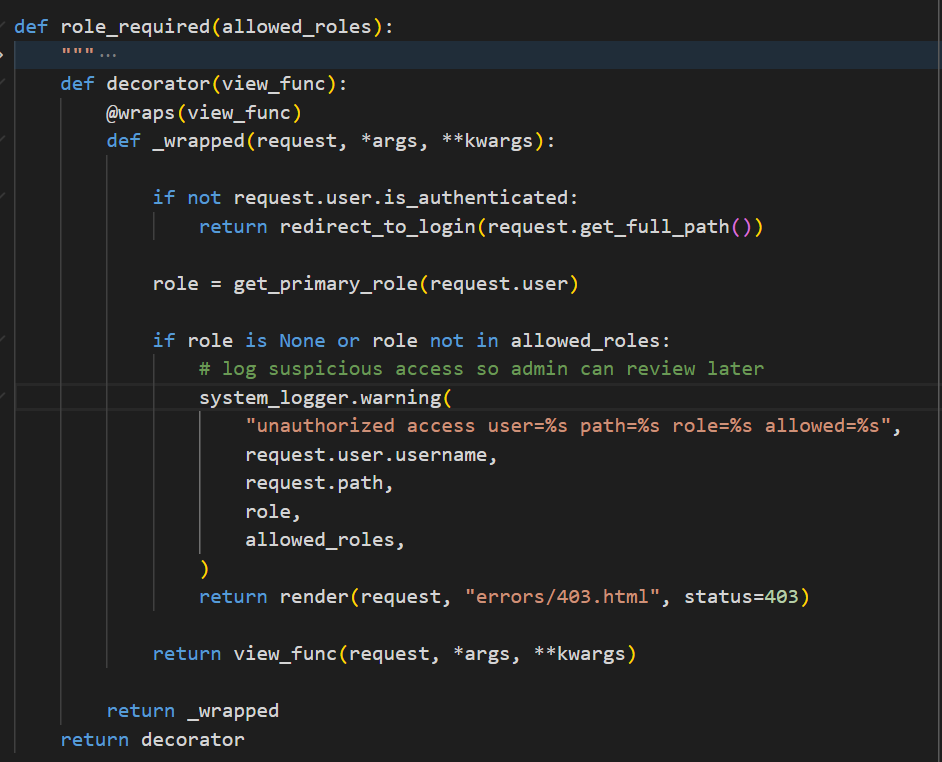
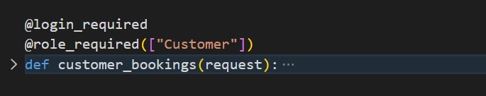

In our project role_required decorator protects views functions so only certain user roles can access them. If the user does not have the allowed role it will render a 403 page otherwise it will return the view function.

It is nested functions because it needs allowed_roles argument before it can wrap the view

it was called in our view


this is equivalent to
```bash
customer_bookings = login_required(role_required(["Customer"])(customer_bookings))
```
where login_required is a Django built in decorator.


